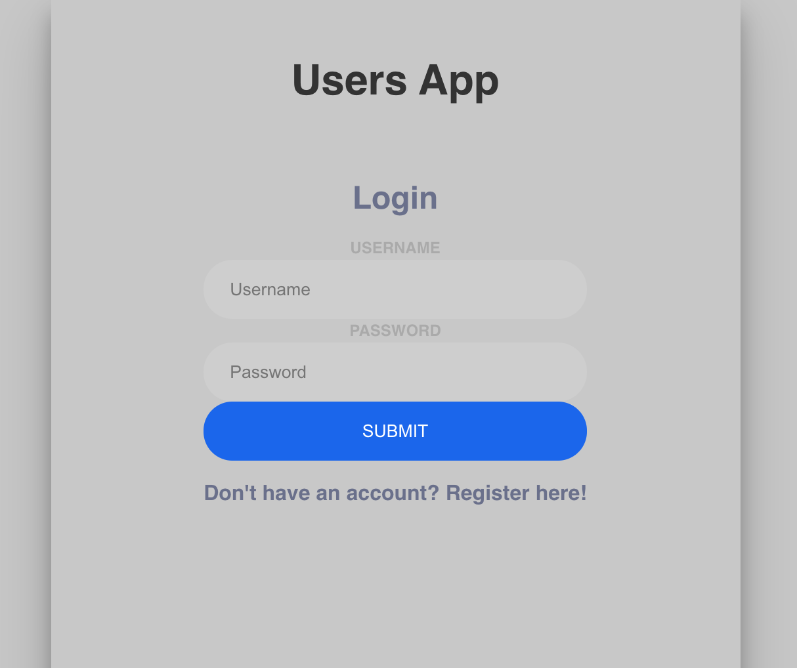
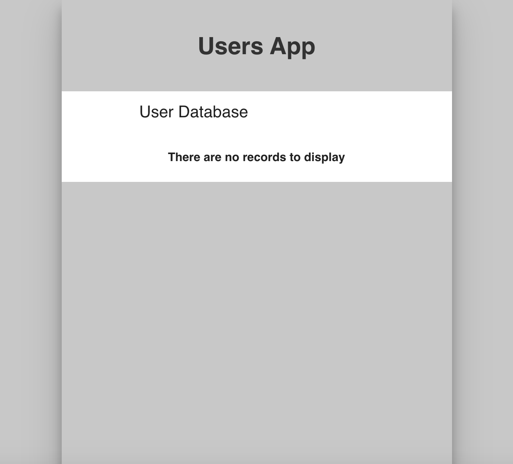
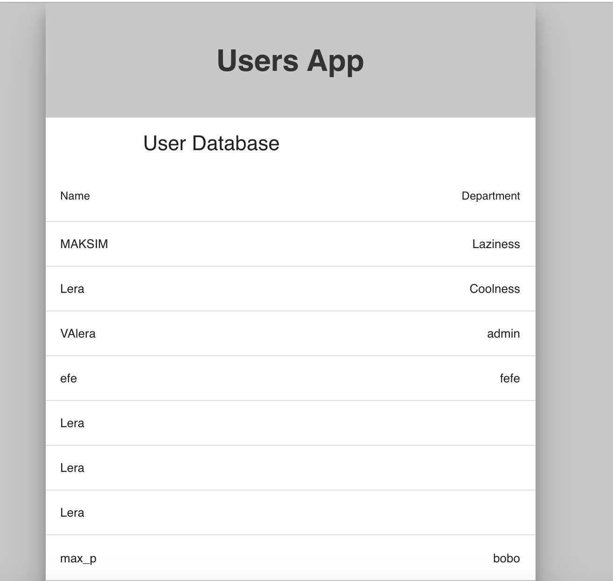

# React-Users-App
Users App with a Node.js backend, sqlite3 database, and a React front-end. Implemented a full authentication workflow with JWT. 

# User Database when a user is signed in with a valid JWT

# User Database when the JWT manually changed (not valid)

